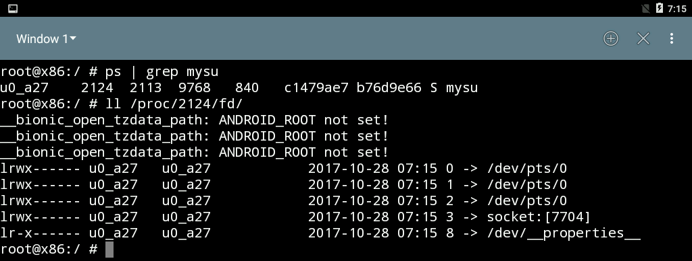

# CS5231 Assignment 2

| Name        | Matriculation No.| Email  |
| ------------- |-------------| -----|
| Tan Yi Yan      | A0127051U | yiyan@u.nus.edu |

## Task 0
### Differences between Android VM and actual Android devices
One difference between them is the recovery OSes installed on them. An actual Android device's recovery OS is the recovery OS placed by vendor. This recovery OS placed by the vendor does not give users a shell prompt so users are unable to run arbitrary commands. Furthermore, the recovery OS placed by the vendor only accepts OTA packages signed by the vendor. In contrast, the Android VM has a general-purpose OS installed as the "recovery OS" - Ubuntu 15.10 is installed as the "recovery OS". To simulate what an actual recovery OS does when installing an OTA update, a recovery program (Neko Android) is installed on the recovery OS. This recovery program allows users access to both a normal user shell and a root shell so users are able to run arbitrary commands and make arbitrary changes to the Android partition. Moreover, the recovery program in the Android VM also allows users to disable digital signature verification of the OTA packages - this functionality is not available in the recovery OS of an actual Android device.

Another difference is location where the `rc` script files imported by `init.rc` are stored. In an actual Android device, these script files are inside `boot.img`, which contains `ramdisk.img` and the kernel. On the other hand, these
script files are are stored in the `ramdisk.img` image file on the Android VM.

In addition, the state of the bootloader may also be different. In an actual Android device, the bootloader is usually "locked". With a locked bootloader, any attempt to flash the installed OS will be denied by the bootloader. The manufacturers may or may not choose to permanently lock the bootloader so the bootloader cannot be unlocked with normal means. For the lab, it is assumed that the bootloader on the Android VM can be unlocked and it was "unlocked" at some point to replace the stock recovery OS with Ubuntu 15.10.

 

## Task 1

### Problematic component of signature verification process

> Identify which component in the signature verification process is problematic and explain why is it so. (10 Marks)

### Verifying our custom OTA file

> Show and explain how the OTA update service can be made to verify our custom ota file.

### Structure of OTA file

> **NOTE: may change after doing signature verification.** Show the structure of OTA file.

*Figure 1. Structure of OTA file in task 1*

### Dummy file within the Android system

> Show that the dummy file is created within the Android system.

*Figure 2. dummy file created within Android system for task 1*

## Task 2

### Structure of OTA file

> **NOTE: may change after doing signature verification.** Show the structure of OTA file.

*Figure 3. Structure of OTA file in task 2*

### Dummy file within the Android system

*Figure 4. dummy2 file created within Android system for task 2*

### Differences between the dummy files are created in Task 1 and 2

- file permissions
- when it is created?? init vs app_process

## Task 3

### The root shell

> Show that root shell can be obtained.

*Figure 5. The root shell obtained in task 3*

### File descriptors of the client and shell processes

> Show that the client and shell processes share the same file descriptors.

*Figure 6. File descriptors of client process*

*Figure 7. File descriptors of shell process*

### Source file

> Indicate where in the source files does the following actions happen (Filename, function name, and line
number need to be provided in the answer) : (30 Marks)
Server launches the original app process binary Client sends its FDs
Server forks to a child process
Child process receives client’s FDs
Child process redirects its standard I/O FDs Child process launches a root shell
