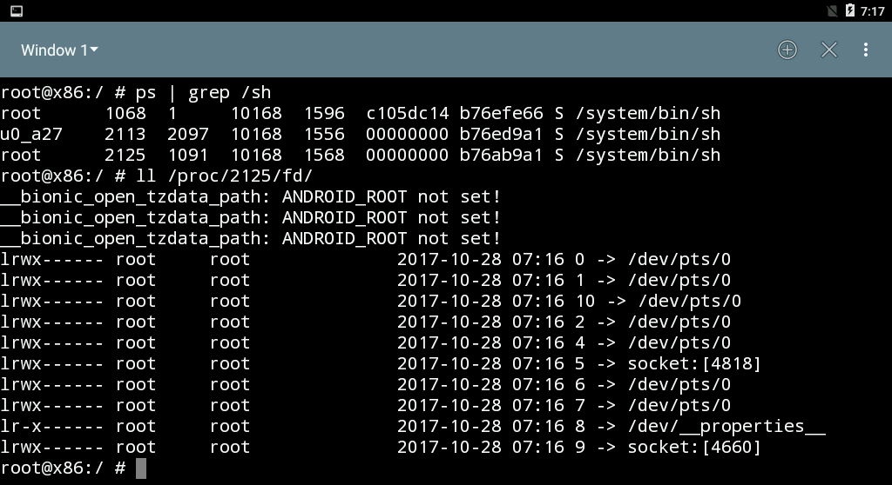

# CS5231 Assignment 2

| Name        | Matriculation No.| Email  |
| ------------- |-------------| -----|
| Tan Yi Yan      | A0127051U | yiyan@u.nus.edu |

## Task 0
### Differences between Android VM and actual Android devices
One difference between them is the recovery OSes installed on them. An actual Android device's recovery OS is the recovery OS placed by vendor. This recovery OS placed by the vendor does not give users a shell prompt so users are unable to run arbitrary commands. Furthermore, the recovery OS placed by the vendor only accepts OTA packages signed by the vendor. In contrast, the Android VM has a general-purpose OS installed as the "recovery OS" - Ubuntu 15.10 is installed as the "recovery OS". To simulate what an actual recovery OS does when installing an OTA update, a recovery program (Neko Android) is installed on the recovery OS. This recovery program allows users access to both a normal user shell and a root shell so users are able to run arbitrary commands and make arbitrary changes to the Android partition. Moreover, the recovery program in the Android VM also allows users to disable digital signature verification of the OTA packages - this functionality is not available in the recovery OS of an actual Android device.

Another difference is location where the `rc` script files imported by `init.rc` are stored. In an actual Android device, these script files are inside `boot.img`, which contains `ramdisk.img` and the kernel. On the other hand, these
script files are are stored in the `ramdisk.img` image file on the Android VM.

In addition, the state of the bootloader may also be different. In an actual Android device, the bootloader is usually "locked". With a locked bootloader, any attempt to flash the installed OS will be denied by the bootloader. The manufacturers may or may not choose to permanently lock the bootloader so the bootloader cannot be unlocked with normal means. For the lab, it is assumed that the bootloader on the Android VM can be unlocked and it was "unlocked" at some point to replace the stock recovery OS with Ubuntu 15.10.

<br>

## Task 1

### Problematic component of signature verification process

> Identify which component in the signature verification process is problematic and explain why is it so. (10 Marks)

https://source.android.com/devices/tech/ota/sign_builds

> Update packages received from the main system are typically verified twice: once by the main system, using the RecoverySystem.verifyPackage() method in the android API, and then again by recovery. The RecoverySystem API checks the signature against public keys stored in the main system, in the file /system/etc/security/otacerts.zip (by default). Recovery checks the signature against public keys stored in the recovery partition RAM disk, in the file /res/keys.

one of the checks not working?
scp?

### Verifying our custom OTA file

> Show and explain how the OTA update service can be made to verify our custom ota file.

### Structure of OTA file


*Figure 1. Structure of OTA file in task 1*

### Dummy file within the Android system


*Figure 2. dummy file created within Android system for task 1*

## Task 2

### Structure of OTA file


*Figure 3. Structure of OTA file in task 2*

### Dummy file within the Android system


*Figure 4. dummy2 file created within Android system for task 2*

### Differences between the dummy files created in Task 1 and 2

One difference between the dummy files created in Task 1 and 2 is when they are created. In task 1, the `dummy` file is created when the file `/system/etc/init.sh` is executed. In the `init.sh`, a command to run `dummy.sh` was added by me (via the OTA's update-binary using `sed`) and when this command to run `dummy.sh` is executed, the `dummy` file is created. On the other hand, the `dummy2` file is created when my wrapper program for `app_process` is executed (when the Android OS bootstraps its runtime). The wrapper program creates the `dummy2` file and then invokes the original `app_process` (which was renamed to `app_process_original`).

Another difference between the dummy files is their permissions. For `dummy` that is created in task 1, the permissions is `-rw-rw-rw-`, as seen in Figure 2. In contrast, the permissions for `dummy2` in task 2 is `-rw-------`.  

In addition, one trivial difference between the dummy files is their contents. `dummy` in task 1 contains "hello" whereas `dummy2` in task 2 is an empty file. 

## Task 3

### The root shell

After starting the client program `mysu`, the root shell is obtained. This can be seen in Figure 5. below.  


*Figure 5. The root shell obtained in task 3*

### File descriptors of the client and shell processes

Figure 6. and Figure 7. shows the `/proc/<PID>/fd` of the client and the shell processes respectively. As seen in the figures, all the file descriptors point to `/dev/pts/0`.  


*Figure 6. File descriptors of client process*


*Figure 7. File descriptors of shell process*

### Source file

#### Server launches the original app process binary
In *mydaemonsu.c*'s `main()` function, lines 252 to 253:
```
argv[0] = APP_PROCESS;
execve(argv[0], argv, environ);
```

#### Client sends its FDs
In *mysu.c*'s `connect_daemon()` function, lines 101 to 103:
```
send_fd(socket, STDIN_FILENO);      //STDIN_FILENO = 0
send_fd(socket, STDOUT_FILENO);     //STDOUT_FILENO = 1
send_fd(socket, STDERR_FILENO);     //STDERR_FILENO = 2
```

#### Server forks to a child process
In *mydaemonsu.c*'s `run_daemon()` function, line 189:
```
if (0 == fork()) {
```

#### Child process receives client’s FDs
In *mydaemonsu.c*'s `child_process()` function, lines 147 to 149:
```
int client_in = recv_fd(socket);
int client_out = recv_fd(socket);
int client_err = recv_fd(socket);
```

#### Child process redirects its standard I/O FDs
In *mydaemonsu.c*'s `child_process()` function, lines 151 to 153:
```
dup2(client_in, STDIN_FILENO);      //STDIN_FILENO = 0
dup2(client_out, STDOUT_FILENO);    //STDOUT_FILENO = 1
dup2(client_err, STDERR_FILENO);    //STDERR_FILENO = 2
```

#### Child process launches a root shell
In *mydaemonsu.c*'s `child_process()` function, line 162:
```
execve(shell[0], shell, env);
```
